# Lab report 4
### Step 1: Log into ieng6

#### SSH into my username

I typed in "ssh" and then typed my username "cs15lfa23ay@ieng6.ucsd.edu" and finally pressed `<enter>` to log onto ieng6.  
 
 
 
I was prompted to enter my passowrd although I already have my save key (I am guessing this is because I was on my home connection. I had the same issues at UCSD until I logged into UCSD_Protected). I typed in "*******" then pressed `<enter>` and got logged in.  
 
 
 

### Step 2: Clone the fork using the `SSH` link  

 
 
I copied the `SSH` URL from my forked repo on Github, using `<Ctrl>` `c`, and the typed `git clone` into the terminal and pasted the URL with `<Ctrl>` `v` and finally pressed `<enter>` to clone the repository.
 
 

 
I then typed `cd` and `lab7` and pressed `<enter>` to change into the lab7 directory.
 

### Step 3: Run the tests to demonstrate they fail

In this step, I typed in `ls` and pressed `<enter>` to display the files in the current directory. This is because majority of the time, we will not remeber the name of a file of the top of our head, so it is very useful to `ls` into a directory and see its contents. Once I found the file that I needed (test.sh), I typed `bash<space>test.sh` and pressed `<enter>` to run the tests within the bash file. The reason I typed `bash` is because `test.sh` essentially is a shortcut to run the java file `ListExamplestests` which has a series of `junit` tests, written to test the correctness of `ListExamples`.  
 
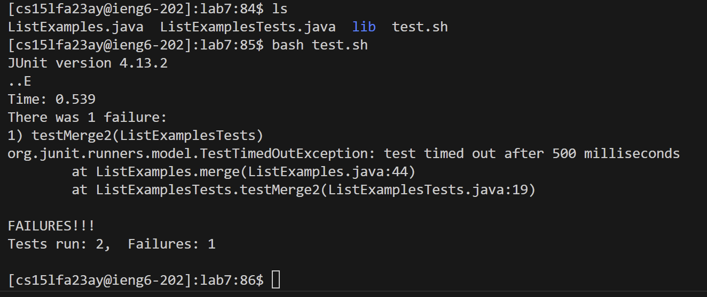
 
As displayed in the image above, there is 1 failure after running the 2 tests. 

### Step 4: Edit the code to fix the failing test

To edit the code, I used the built-in text editor, Vim. I typed `Vim ListExamples.java` into the terminal then pressed `<enter>`.
   
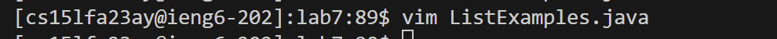
   
This is the terminal after I pressed `<enter>`.
   
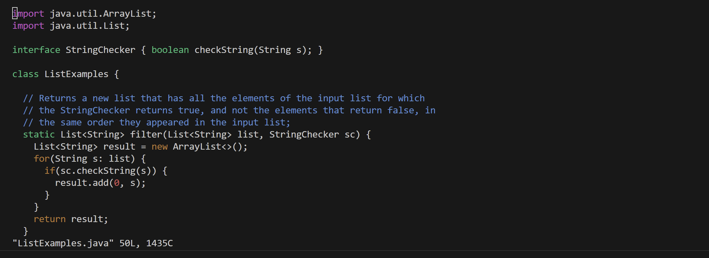
  
Now, we have to remember, the error in the code is just that `index1` is used instead of `index2` in the final loop in `merge`. So what I am going to do is to search for the word `index1` and skip through until I find the correct one.  
**How? :** I press `ESC` to make sure that I am in normal mode, then I press `/` and then I type `index1`. As we learned in class, `/<text>` searches for a keyword. The forward-slash is basically the search command and the text after it is the keyword that it will look for. We also should not forget to press `<enter>` to lock in our word, `index1`. 
  
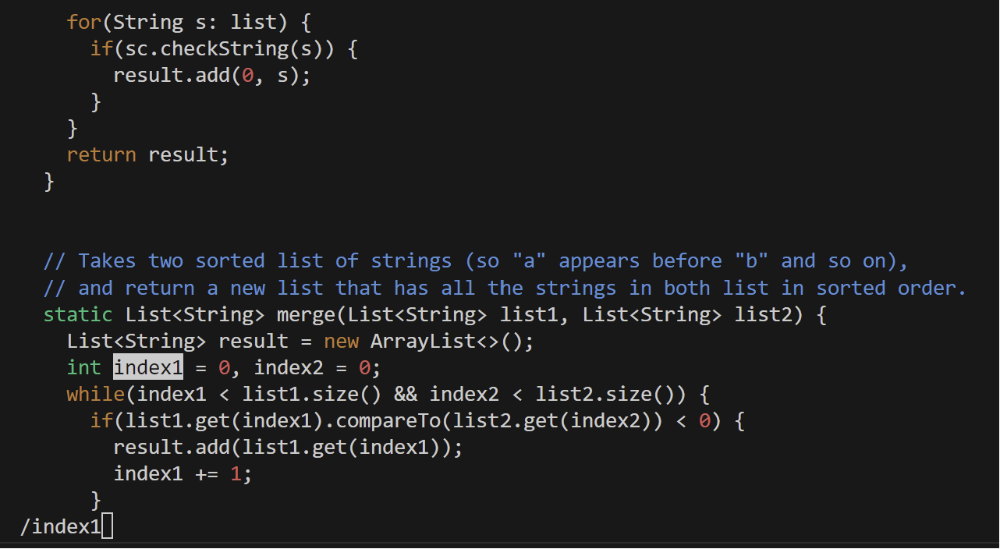 
  
As we see in the image, it found the first occurrence of `index1`. Now, that specific occurrence of `index1` is not the one we are particularly looking for. But nothing to worry as we can press `n` to go to the next occurrence of `index1`.  
  

  
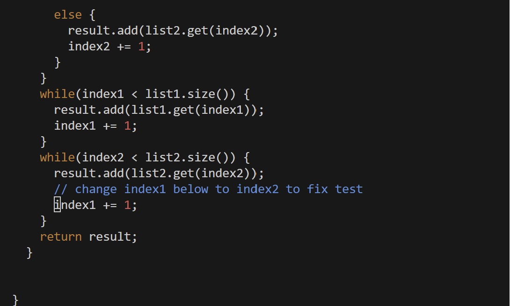
  
After pressing `n` 9 times, we are on the desired occurrence of `index1`. So far, what he have in this step if `vim ListExamples.java <enter> / i n d e x 1 <enter> n n n n n n n n n` (I separated them by a space to make it easier to read). Now that we are at the desired word, we need to edit the 1 and turn it into a 2.  
Notice that currently, we are on the "i" of `index1`and we need to relocate our cursor to the 1. We learned in clas that we can use `h`,`j`,`k`, and `l` to move around in vim. I used `l` because it moves the cursor to the right by 1 each press. I pressed `l` 5 times to get to 1. So far we have `vim ListExamples.java <enter> / i n d e x 1 <enter> n n n n n n n n n l l l l l`.
  
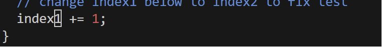
  
Now to delete the 1, I pressed `x`. We learned in class that `x` deletes whatever character the cursor is on.
  
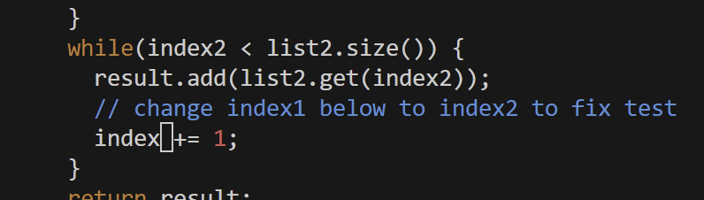
   
Now that the 1 is deleted, I pressed `i` to go into insert mode. Once we are in insert mode, we can type 2. 
  
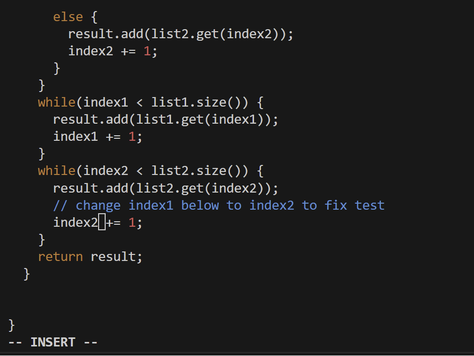
  
Now that we corrected the mistake, we can exit out of vim to finish this step. In order to do so, first we need to press `<ESC>` to go back into normal mode, then we press `:` and type in `wq` and then press `<enter>`. 
  
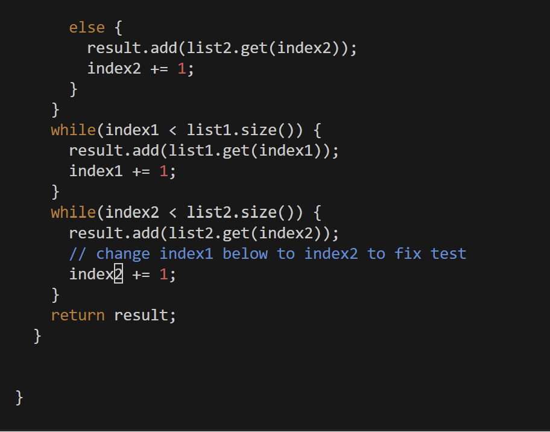
  
Now that we are in normal mode, we press `:` and then type `wq` and then press `<enter>`.
  
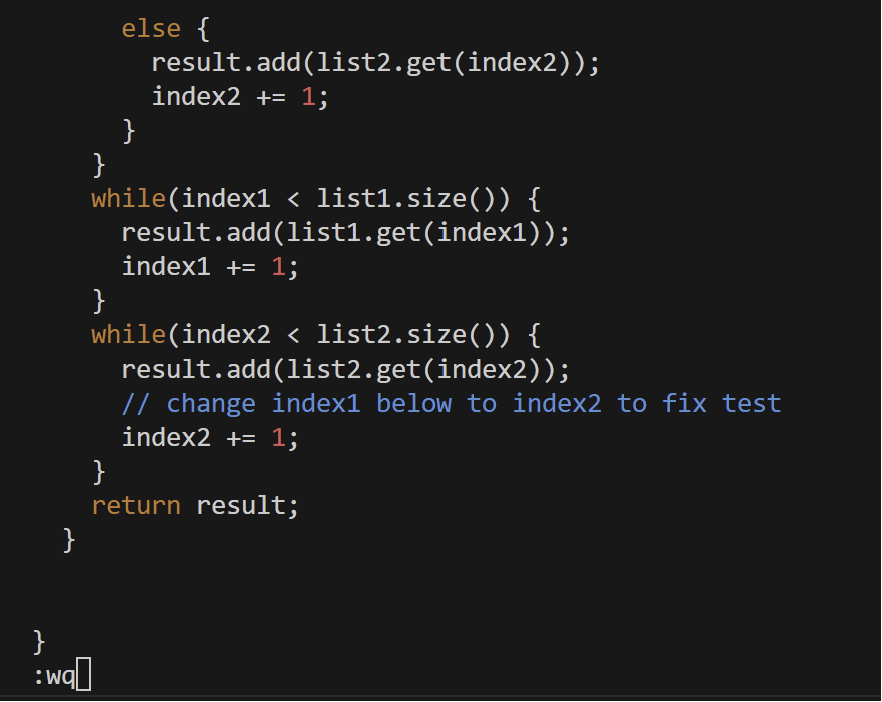
  
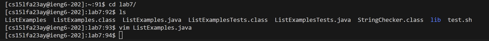
   
The image above displays what happens after we pressed `<enter>`. 
**Explanation:** Now to explaing what the commands above did; as mentioned before, when we pressed `i`, we were taken into insert mode, meaning we can edit the text. To exit that mode, we had to press `<ESC>` to go into normal mode. Then when we were in normal mode, we pressed `:` which takes us into command line mode. Once we were into command line mode, we typed in `wq`. `w` means "write" (aka save) in vim and q means "quit". So when we pair `w` and `q` and then press `<enter>`, it basically means "save and quit". Hence why we were back at the home terminal after pressing `<enter>`.  
So at the end of this step, the keys we pressed were: `v i m L i s t E x a m p l e s . j a v a <enter> / i n d e x 1 <enter> n n n n n n n n n l l l l l x i 2 <ESC> : w q <enter>`

### Step 5: Run the tests to demonstrate their correctness

Following the exact steps as step 3, we type `bash test.sh` into the terminal and press `<enter>`.
  
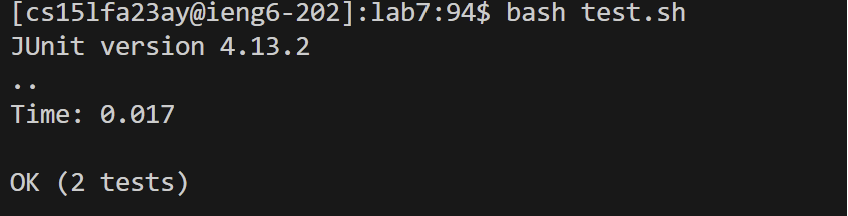
  
As displayed in the image above, the tests did run successfully this time. 

### Step 6: Commit and push to Github

In this step, we have to add the modified file (ListExamples.java), commit, and then push itt to Github. First, I started by typing `git add ListExamples.java` and then pressed `<enter>`. Now the file is staged. In order to double check that the desired file is staged, we can type `git status` and the press `<enter>`. 
  
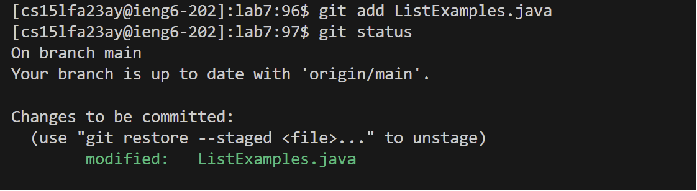
  
As we can see in the image, `ListExamples.java` is staged to be committed. Next we type `git commit` and press `<entern>`. This takes us to another page on our terminal, asking for a commit message. 
  
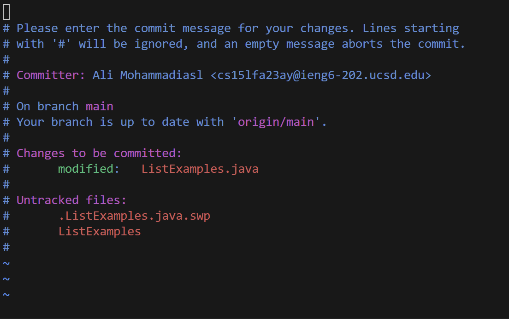
  
What's interesting t note is that this isn't just any random page opened by the terminal, it's vim. Remembering how we can add text in vim, we press `i` to enter insert mode, and type a commit message.
  
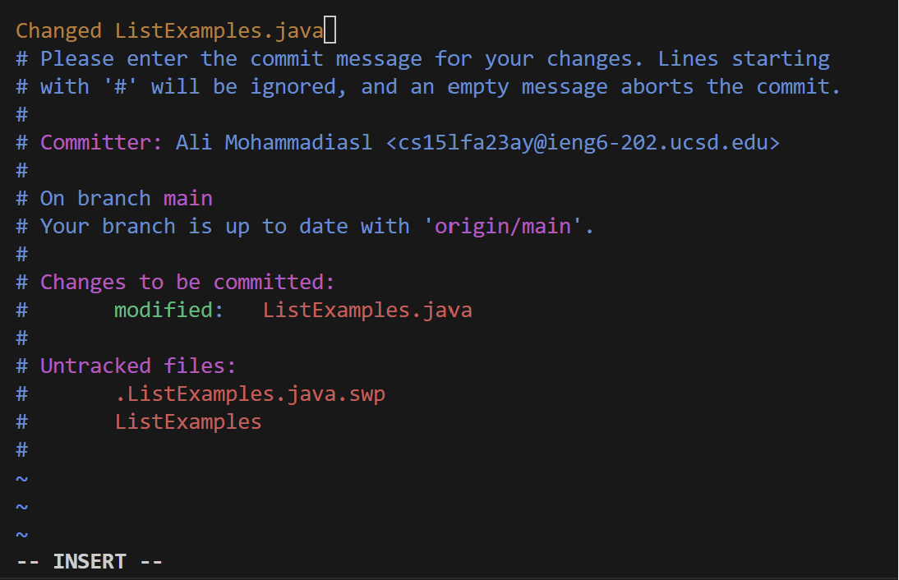
  
My commit message was "Changed ListExamples.java". Commit messages typically exaplain the modification that has been made. After typing in a commit message, we follow the same steps as before to exit vim; press `<ESC>` then press `:` and type `wq` then press `<enter>`. This takes us back to the terminal. 
  
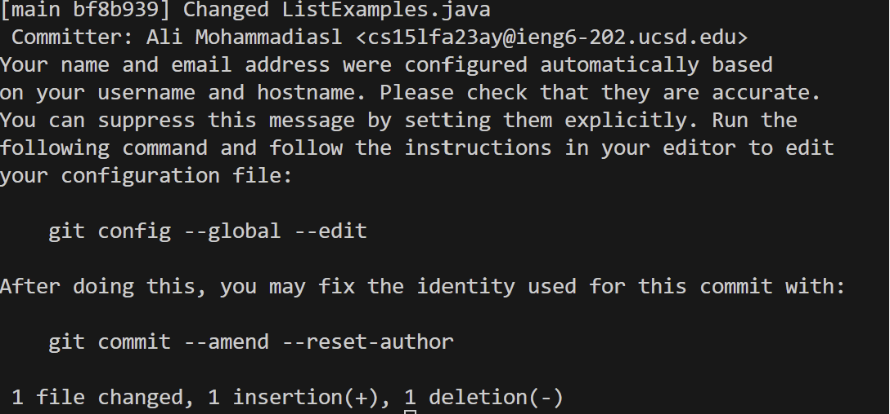
  
Finally, we can type `git push` in the terminal and then press `<enter>` to push the staged changed into Github.
  
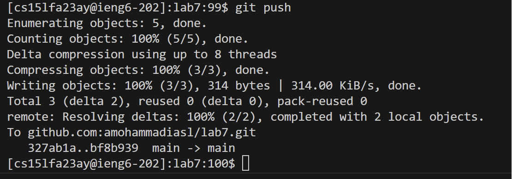

