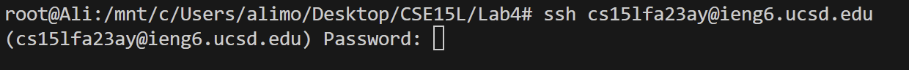
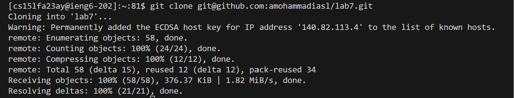

# Lab report 4
### Step 1: Log into ieng6
#### SSH into my username
I typed in "ssh" and then typed my username "cs15lfa23ay@ieng6.ucsd.edu" and finally pressed `<enter>` to log onto ieng6.  
 
 
 
I was prompted to enter my passowrd although I already have my save key (I am guessing this is because I was on my home connection. I had the same issues at UCSD until I logged into UCSD_Protected). I typed in "*******" then pressed `<enter>` and got logged in.  
 
 
 
### Step 2: Clone the fork using the `SSH` link  
 
 
I copied the `SSH` URL from my forked repo on Github, using `<Ctrl>` `c`, and the typed `git clone` into the terminal and pasted the URL with `<Ctrl>` `v` and finally pressed `<enter>` to clone the repository.
