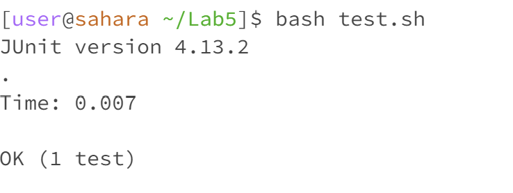
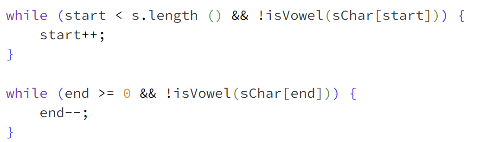

# Lab Report 5
## Part1, EdStem thread: reverse vowels assigment:
### The goal of this assignment is to write a fucntion that takes a string, and reverses the order of all the vowels in there (e.g hello -> holle).

<br>

### EdStem thread: Error when testing the reverse vowels method!

<br>
<br>
Below you can find my code for the reverse vowels method as well as the code for my testing method respectively.
<br>
```java
void swap(char[] chars, int x, int y) {
        char temp = chars[x];
        chars[x] = chars[y];
        chars[y] = temp;
    }
    
    public String reverseVowels(String s) {
        int start = 0;
        int end = s.length() - 1;

        char[] sChar = s.toCharArray();
        
        while (start < end) {
            
            while (start < s.length () && isVowel(sChar[start])) {
                start++;
            }

            while (end >= 0 && isVowel(sChar[end])) {
                end--;
            }

            if (start < end) {
                swap(sChar, start++, end--);
            }
        }
        

        return new String(sChar);
    }
```

```java
public void testReverseVowels1() {
        Solution solution = new Solution();
        String input = "Hello World!";
        String expected = "Hollo Werld!";
        assertEquals(expected, solution.reverseVowels(input));
    }
```
I wrote a test case that takes the string "Hello World!" and is supposed to return "Hollo Werld!". However, my function returns a string that looks nothing like this at all. My guess is that I am swapping the characters at the wrong time and I made a mistake in some part of my logic, however, I can not figure out what part. I also looked at my `isVowel` method and I believe it looks correct. <br>
Can i please get some help on what could be possibly going wrong? 
Thank you!

### EdStem TA respone: Re- Error when testing the reverse vowels method!
Dear student, I was able to take a look at your `testReverseVowels1` method and it looks correct so that eliminates one source for the problem. The `isVowels` method is also correct as it checks for every lower and upper case vowel. This narrows down the problem to the logic of the `reverseVowels` function. My hint to you is to look within the reverseVowels method, and carefully observe the conditions in the inner while loops where vowel checking takes place. Consider the role of these conditions in determining when to move the start and end pointers. Pay attention to how the loop logic should respond to vowels and non-vowels. In other words, when do we move the right pointer and when do we right the left pointer with respect to a `Char` being a vowel or not being a vowel. <br>
Lastly, I wanted you to notice how I went about potentially finding the bug in the code. A method that always helps is to eliminate different factors that could potentially be casuing problems, narrowing down the source of the problem. <br>
Let me know if that helps!
<br>
### EdStem Student respone: Error fixed!
Dear TA, thank you for the hint! I was able to get the function working! Below I have attached the screenshot of what I fixed as well as the successful test! 
<br> 

<br>
<br>

<br><br> 
My file directory structure looks like: <br>
-Lab5 <br>
--Lib <br>
--reverseVowels.java <br>
--reverseVowelsTests.java <br>
--test.sh <br>
<br>
The `Lib` file includes the `Junit` library that is required for conducting `Junit` tests. The code for `reverseVowels.java`, `reverseVowelsTests.java`, and `test.sh` can be found below in respective order. <br>
```java
class Solution {

    public static void main(String[] args) {
        Solution solution = new Solution();
    }

    boolean isVowel(char c) {
        return c == 'a' || c == 'i' || c == 'e' || c == 'o' || c == 'u'
            || c == 'A' || c == 'I' || c == 'E' || c == 'O' || c == 'U';
    }
    
    void swap(char[] chars, int x, int y) {
        char temp = chars[x];
        chars[x] = chars[y];
        chars[y] = temp;
    }
    
    public String reverseVowels(String s) {
        int start = 0;
        int end = s.length() - 1;

        char[] sChar = s.toCharArray();
        
        while (start < end) {
            
            while (start < s.length () && !isVowel(sChar[start])) {
                start++;
            }

            while (end >= 0 && !isVowel(sChar[end])) {
                end--;
            }

            if (start < end) {
                swap(sChar, start++, end--);
            }
        }
        

        return new String(sChar);
    }
};
```
<br>

```java
import static org.junit.Assert.*;
import org.junit.*;

public class reverseVowelsTests {

    @Test(timeout = 500)
    public void testReverseVowels1() {
        Solution solution = new Solution();
        String input = "Hello World!";
        String expected = "Hollo Werld!";
        assertEquals(expected, solution.reverseVowels(input));
    }

}
```
<br>

```bash
javac -cp .:lib/hamcrest-core-1.3.jar:lib/junit-4.13.2.jar *.java
java -cp .:lib/hamcrest-core-1.3.jar:lib/junit-4.13.2.jar org.junit.runner.JUnitCore reverseVowelsTests
```
<br>

I was having that bug because of an incorrect logic in my inner loop statements. I simpley used `bash test.sh` to run the test example and received the bug. Initially, I was chwecking whether the current character is a vowel, and if that was true, I was moving the left pointer right by one and moving the right pointer left by one. This makes the logic incorrect because it would essentially skip over the vowel and swap the non-vowel characters. I simply had to add a `!` to fix the logic. This time, the inner loops would actually stop when the left and the right pointer are both at a vowel, and then we would be able to swap those two vowels. 
<br>
## Part 2
What I found extremly helpful in the second half of the course, was the Vim lab. I had always heard one of my friends talking about how powerful Vim is and he always encouraged me to move to Vim rather than VS Code, and using it in the lab really helped me understand just how powerful it really is. I am in no way an expert in Vim right now, however, I can see how useful it can be and I am going to continue learning and mastering Vim outside of this course. Vim can be very complicated and hard to get used to, however, I believe in the long run, it will be a very powerful tool to know about. 
<br>
## Sources 
Leetcode 345
<br> 
The problem I used for this post was an actual problem one of my friends encountered while doing this leetcode problem. I tried to mimic how I actually helped my friend without giving too many hints so that he would actually be able to realize why the problem is caused. 
