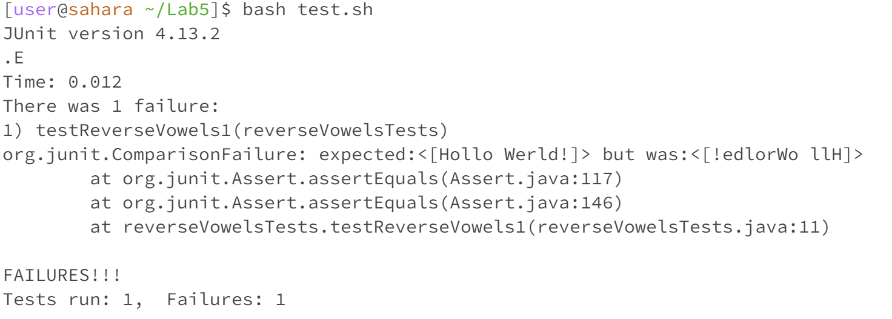

# Lab Report 5
## EdStem thread: reverse vowels assigment:
### The goal of this assignment is to write a fucntion that takes a string, and reverses the order of all the vowels in there (e.g hello -> holle).

<br>

#### EdStem thread: Error when testing the reverse vowels method!

<br>
<br>
Below you can find my code for the reverse vowels method as well as the code for my testing method respectively.
<br>
```java
void swap(char[] chars, int x, int y) {
        char temp = chars[x];
        chars[x] = chars[y];
        chars[y] = temp;
    }
    
    public String reverseVowels(String s) {
        int start = 0;
        int end = s.length() - 1;

        char[] sChar = s.toCharArray();
        
        while (start < end) {
            
            while (start < s.length () && isVowel(sChar[start])) {
                start++;
            }

            while (end >= 0 && isVowel(sChar[end])) {
                end--;
            }

            if (start < end) {
                swap(sChar, start++, end--);
            }
        }
        

        return new String(sChar);
    }
```

```java
public void testReverseVowels1() {
        Solution solution = new Solution();
        String input = "Hello World!";
        String expected = "Hollo Werld!";
        assertEquals(expected, solution.reverseVowels(input));
    }
```
Can i please get some help on what could be possibly going wrong? 
Thank you!

#### EdStem TA respone: Re- Error when testing the reverse vowels method!
Dear student, I was able to take a look at your `testReverseVowels1` method and it looks correct so that eliminates one source for the problem. 
